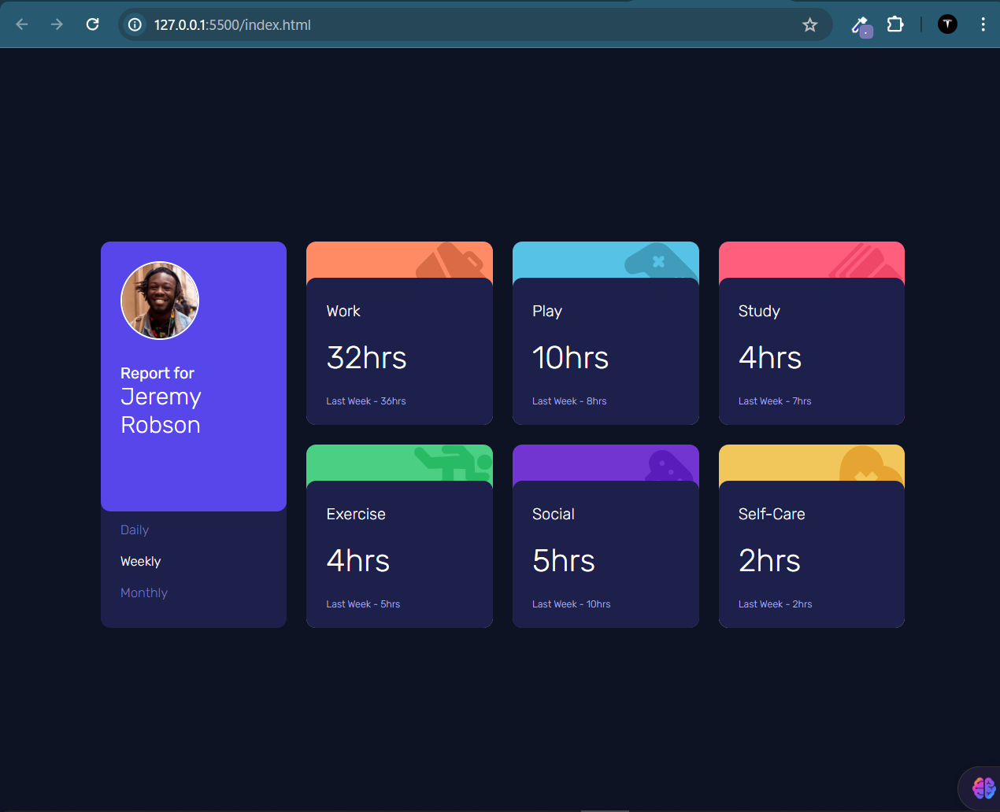

# Frontend Mentor - Time tracking dashboard challenge

This is a solution to the [Time Tracking Dashboard component challenge on Frontend Mentor](https://www.frontendmentor.io/challenges/time-tracking-dashboard-UIQ7167Jw).

## Table of contents

- [Overview](#overview)
  - [Screenshot](#screenshot)
  - [Links](#links)
  - [Built with](#built-with)

- [Author](#author)

## Overview
This project is a front-end coding challenge provided by Frontend Mentor.

### Screenshot

...

### Links

- Solution URL: [Task2_QR_Code](https://github.com/Marshal-Emanuel/teach2give_task3_desktopDesign)
- Live Site URL: [Live page](https://marshal-emanuel.github.io/teach2give_task3_desktopDesign/)

## My process

### Built with

- Semantic HTML5 markup
- Vannila CSS

## Author
- : [Marshal-Emanuel](https://github.com/Marshal-Emanuel)
